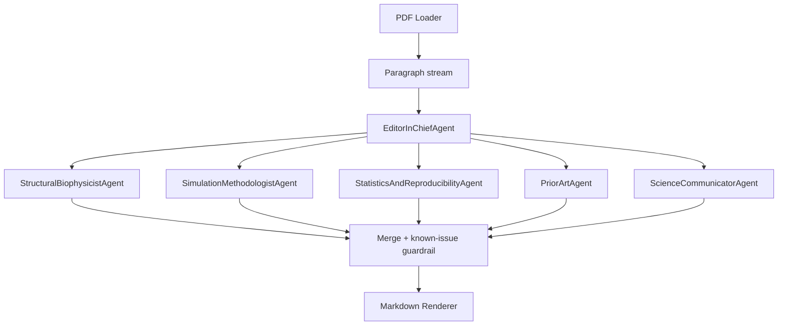

# HKGAP Multi-Agent Critical Review Workflow

This package builds a paragraph-by-paragraph critical review pipeline for the HKGAP short paper. A single prompt is insufficient because domain-physics checks, simulation-method rigor, reproducibility statistics, prior-art novelty, and plain-language explanation are distinct competencies; the workflow therefore runs five specialist agents in parallel and merges them with an Editor-in-Chief layer.

## Architecture



## Quickstart

```bash
cp .env.example .env && pip install -e . && python -m hkgap_review review --pdf "../HKGAP PAPER SHORT VERSION 1.1.pdf" --out reviews/short_paper_review.md
```

## How to swap models

Set `MODEL_NAME` in `.env` (for example `MODEL_NAME=gpt-4o-mini`). The provider layer reads `LLM_PROVIDER` and environment credentials to switch between OpenAI-compatible providers.

## Academic integrity

This workflow is a **decision-support tool for the author**, not a substitute for human peer review. It is designed to flag potential issues and unverifiable claims, but every flagged item must be checked by a human before manuscript edits or submission decisions are made.
